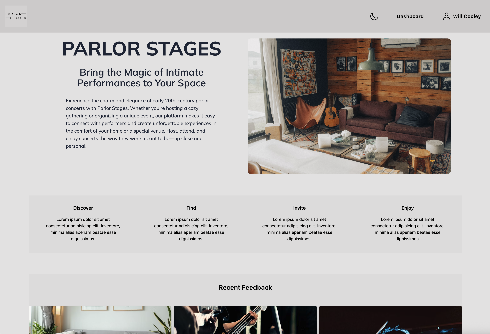
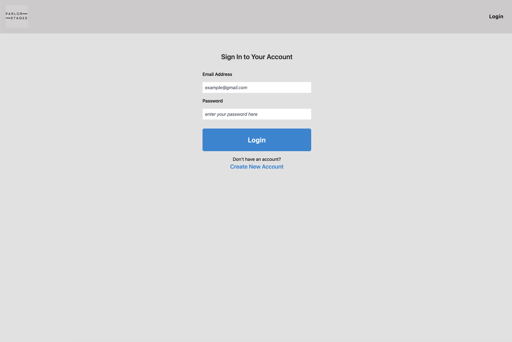
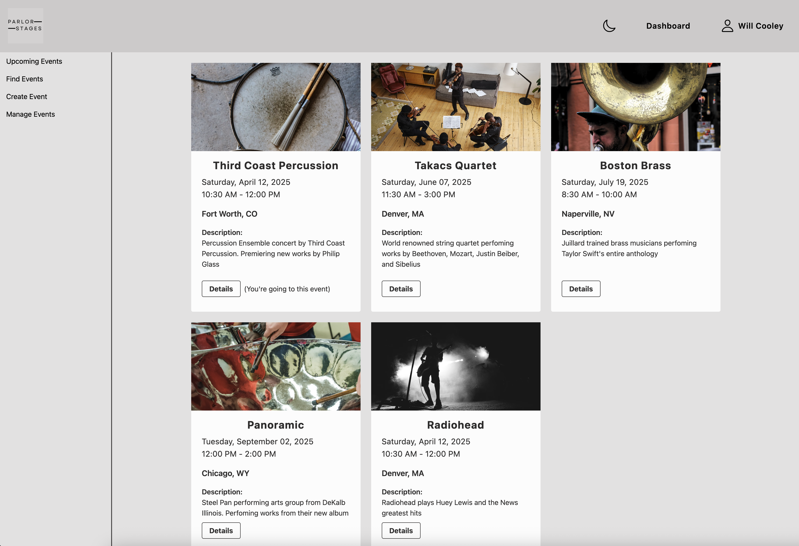
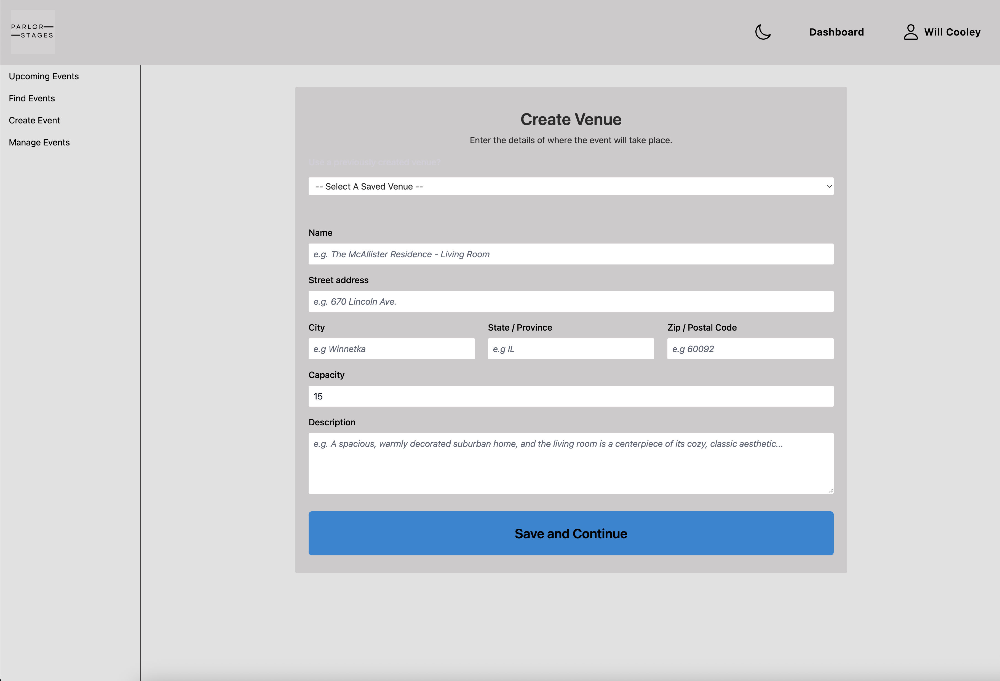
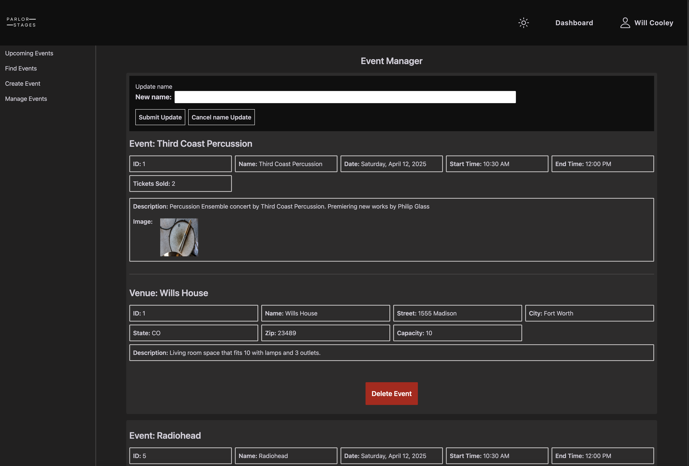

# Parlor Stages

An Event Management Appliction.

## Usage

- npm install
- pipenv install && pipenv shell
- _to setup the database:_
- flask db init
- flask migrate -m _'comment'_
- flask db upgrade
- _to seed the database:_
- python seed.py
- _to run the application:_
- cd into the server then run python app.py
- in another terminal run: npm run dev --prefix client

#### Login

A user can create an account or login if they already have an account.

#### Dashboard

Once logged in, users can view their profile, view their upcoming events, find an event, create an event, and manage their created events.

## Support

If you have any questions, you can find me on Discord: cooleywc

## Acknowledgement

Application built using Vite + React, TailwindCSS, Swiper, and React Date Picker. Included application images are from unsplash.com.